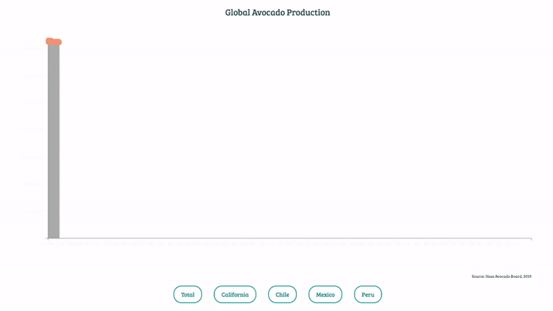
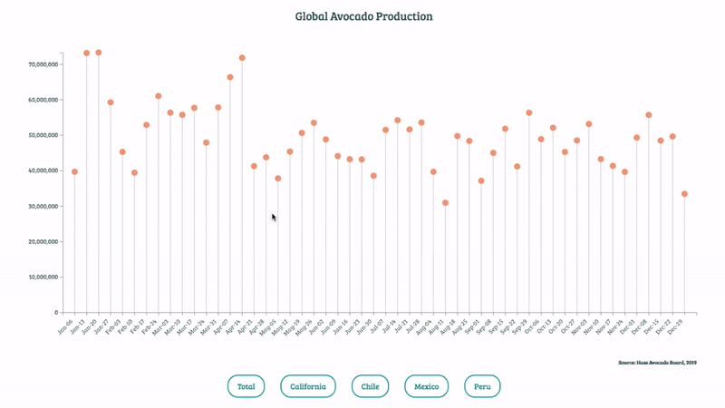

<p align="center">
  
</p>

## Background and Overview
<a href="https://jeanyang0519.github.io/Hello-Avocado/">Live Demo</a>

Avocado is the hot healthy superfood. You can see avocados everywhere - guacamole dips at your friend's party, delicious salads at your parents' table, and of course avocado toast at the overpriced hipster coffee shop right around the corner. 

Hello Avocado is an interactive data visualization on avocado global trade and production. Have fun and get to know more about avocados!


## Technologies 
* D3.js
* JavaScript
* CSS
* HTML

## Code Hightlights
### Update Function

I created the `update` function to show the different datasets by clicking on buttons. To make the click action work, I set unique `id`s and `data-variable`s for each button in `index.html` and use `getElementById` in `lib/volume.js`. When users click on buttons, transitions will be implemented. 



```JavaScript 
// index.html

<div class="lollipop-buttons">
    <button id='clickme-0' data-total="Total">Total</button>
    <button id='clickme-1' data-california="California">California</button>
    ...
</div>


// lib/volume.js

const button0 = document.getElementById('clickme-0')
button0.onclick = () => { update(button0.dataset.total) }

const button1 = document.getElementById('clickme-1')
button1.onclick = () => { update(button1.dataset.california)}

...

function update(selectedVar) {
        
        d3.csv("/data/volume.csv", function (data) {

            ...

            x.domain(data.map(function (d) { return d.Week; }))
            xAxis.transition()
                .duration(1000)
                .call(d3.axisBottom(x))
                .attr("transform", "translate(-0.2," + height + ")")
                .selectAll("text")
                .attr("transform", "translate(-10,0)rotate(-45)")
                .style("text-anchor", "end")
                .attr('x', -8)


            const maxY = d3.max(data, function (d) {
                return +d[selectedVar].split(',').join('')
            })

            y.domain([0, maxY]);
            yAxis.transition()
                .duration(1000)
                .call(d3.axisLeft(y))
                

            const line = svg.selectAll(".Line")
                            .data(data)

            line.enter()
                .append("line")
                .attr("class", "Line")
                .merge(line)
                .transition()
                .duration(1000)
                .attr("x1", function (d) { return x(d.Week); })
                .attr("x2", function (d) { return x(d.Week); })
                .attr("y1", y(0))
                .attr("y2", function (d) { return y(d[selectedVar].split(',').join('')); })
                .attr('opacity', 0.5)
                .attr("color", "red")

            const circle = svg.selectAll("circle")
                              .data(data)

            circle.enter()
                .append("circle")
                .merge(circle)
                .transition()
                .duration(1000)
                .attr("cx", function (d) { return x(d.Week) })
                .attr("cy", function (d) { return y(d[selectedVar].split(',').join('')) })
                .attr("r", 6)
                .attr("fill", "darksalmon")

            ...

        })
    }
```

### Hover Effect

  I implemented the hover effect to show the data for individual data entry by creating `handleMouseOver` and `handleMouseOut` functions. When users hover over the circle at the lollipop chart, the circle will show the data, increase the size of the circle, and change the color. I also attached a class in the `handleMouseOver`, so `handleMouseOut` can identify the class and remove the effect created by `handleMouseOver`. 

  

```JavaScript
// lib/volume.js

svg.selectAll("circle")
    .on("mouseover", handleMouseOver)
    .on("mouseout", handleMouseOut)

function handleMouseOver(d, i) {
    svg.append('text')
        .attr('class', 'hoverVaule')
        .attr("x", x(d.Week) - 20)
        .attr('y', y(d[selectedVar].split(',').join('')) - 18)
        .text(d[selectedVar])
        .attr('font-size', 200)

    d3.select(this)
        .attr('fill', "darkcyan")
        .attr('r', 10)
}

function handleMouseOut(d, i) {
    d3.select('.hoverVaule').remove();
    d3.select(this)
        .attr('fill', "darksalmon")
        .attr('r', 6)
}
```

### Time Format

  I created two variables - `parseDate` and `formatDate` - to read the data from the `csv` file. `parseDate` reads the information from the data file (e.g. "Jan 6, 2019"). `formatDate` transforms the date to only show month and date (e.g. "Jan 6"). Finally, I  iterated through the data and parse the date.

```JavaScript
// lib/volume.js

const parseDate = d3.timeParse("%b %d, %Y");
const formatDate = d3.timeFormat('%b-%d')

data.forEach(function (d) {
    d.Week = formaDate(parseDate(d.Week));
});
```


